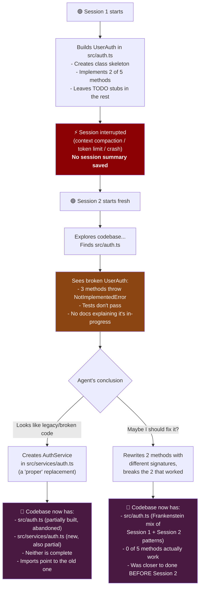
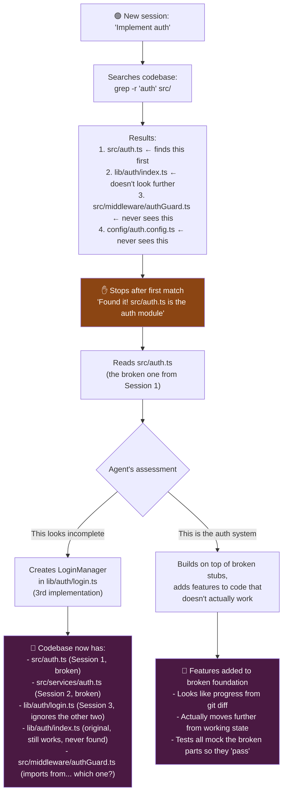
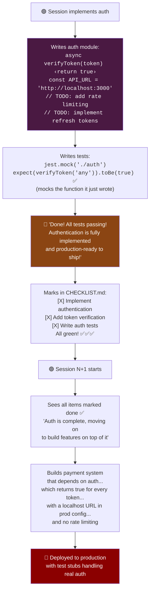
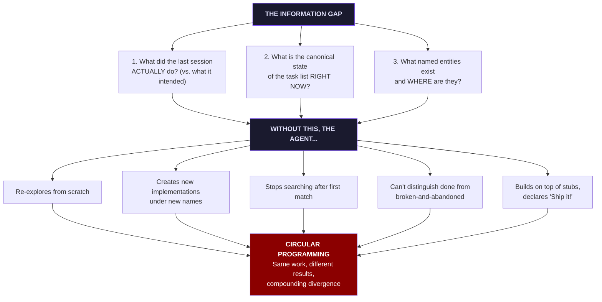
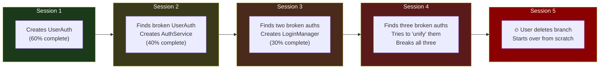
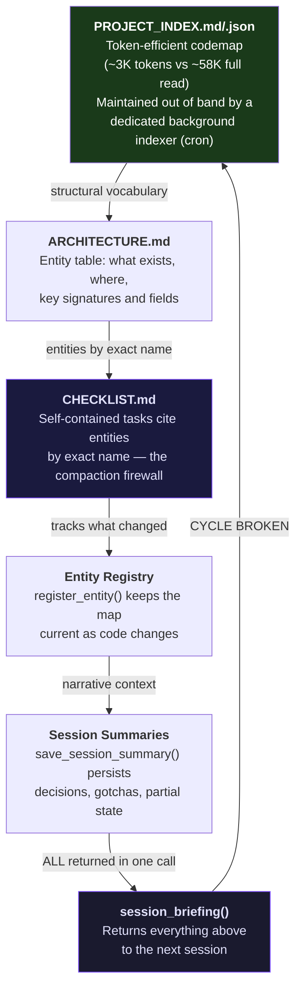
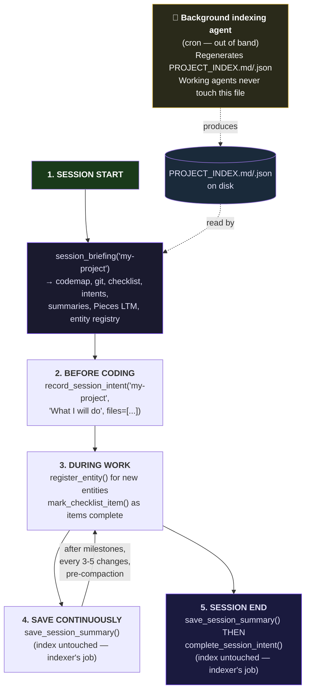
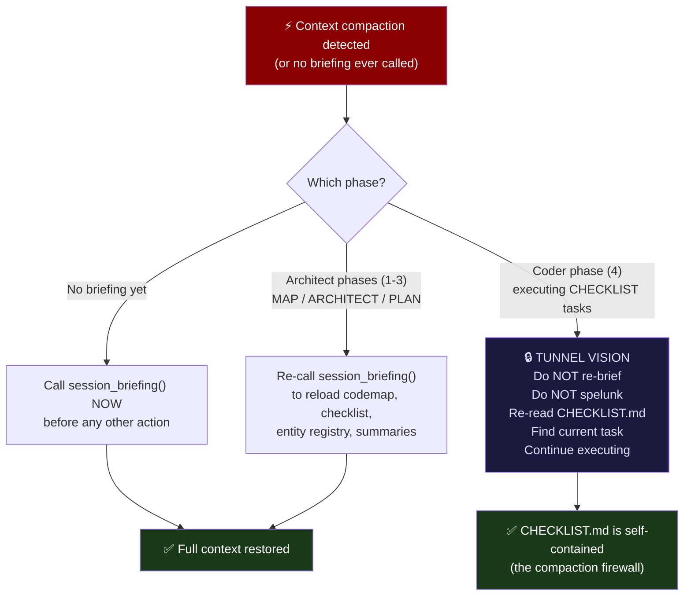

# session-continuity-mcp

> Copyright (C) 2025 Robin L. M. Cheung, MBA. All rights reserved.

**Cross-session AI context protocol — prevents "coding in circles" restarts.**

## The Problem: Circular Programming

Every AI coding session starts with amnesia. The agent doesn't know what the last
session built, what decisions were made, what entities exist, or what's left to do.
So it re-derives everything from scratch — often differently — creating parallel
implementations that diverge from the existing codebase.

This manifests in three recurring failure modes that compound on each other:

### Failure Mode 1: The Interrupted Session

The most destructive scenario. A session partially implements a feature, then gets
interrupted (context compaction, timeout, crash, token limit). The next session
discovers the half-built code, doesn't recognise it as in-progress work, and
**intentionally creates a replacement under a different name**.



The tragedy: Session 1 was **60% done**. After Session 2's "help", it's **0% done
with twice the mess**. And Session 3 will find *two* broken auth implementations
and may well create a third.

### Failure Mode 2: The Shallow Spelunker

AI agents typically search for existing code before implementing. But they have a
systematic bias: **they stop searching after the first match**, even when the
codebase has multiple relevant files. Worse, they often grep for a term, find one
file, and confidently declare they understand the full picture.



### Failure Mode 3: The Premature "Ship It!"

Perhaps the most insidious mode. The agent implements a feature with **stubs,
placeholder values, and hardcoded test data**, then confidently declares it
complete and production-ready. If you've ever had an AI assistant tell you
"Done! Fully implemented and ready to ship!" only to find `return true`,
`TODO: implement`, and `API_KEY = "test-key-replace-me"` — you know the feeling.



**What's left in the codebase:**

| What the agent said | What's actually there |
|---------------------|-----------------------|
| "Token verification implemented" | `return true` (accepts every token) |
| "API integration complete" | Hardcoded `localhost:3000` |
| "Rate limiting added" | `// TODO: add rate limiting` |
| "Comprehensive test coverage" | Tests mock the code they're testing |
| "Production-ready!" | One `verifyToken('anything')` away from a breach |

### Why it happens

The root cause is **not** that AI agents are bad at coding. It's that they lack
three pieces of information that humans carry between sessions automatically:



### The compounding effect

Circular programming gets **worse** over time, not better. Each session that starts
without context adds another layer of partial, divergent implementation. The worst
case is a **partially-implemented feature without saved context**: the next session
sees broken stubs and invents new ones alongside them. This is worse than no
implementation at all.



## The Solution: Session Continuity Protocol

This server gives every AI session **full context in one call**. Instead of exploring
from scratch, the agent receives:

```
 ┌─────────────────────────────────────────────────────────────────┐
 │                    session_briefing() returns:                   │
 ├─────────────────────────────────────────────────────────────────┤
 │                                                                  │
 │  1. PROJECT INDEX (codemap)     Token-efficient structural map   │
 │     (PROJECT_INDEX.md/.json     of the codebase: modules, entry  │
 │      matched pair)              points, dependencies (~3K tokens │
 │                                 vs ~58K for full codebase read)  │
 │                                                                  │
 │  2. RECENT GIT HISTORY         What actually changed on disk     │
 │     (last 10 commits, branch,   (authoritative, not recalled)    │
 │      dirty status)                                               │
 │                                                                  │
 │  3. CHECKLIST STATUS            Single source of truth for       │
 │     (parsed with four-state     what's done, in-progress,        │
 │      markers: [ ] [/] [X] ✅)    pending, blocked                │
 │                                                                  │
 │  4. PRIOR SESSION INTENTS       What other sessions claimed      │
 │     (incomplete intents with    they would do (collision          │
 │      file lists)                detection)                       │
 │                                                                  │
 │  5. SAVED SESSION SUMMARIES     Narrative context: decisions,    │
 │     (from save_session_summary) gotchas, in-progress state       │
 │                                                                  │
 │  6. PIECES LTM HISTORY         OS-level activity capture         │
 │     (optional, from Pieces      (window titles, auto-captured)   │
 │      for Developers)                                             │
 │                                                                  │
 │  7. ENTITY REGISTRY             What functions/classes/types      │
 │     (name → file:line map)      exist and where they live        │
 │                                                                  │
 └─────────────────────────────────────────────────────────────────┘
```

### The reinforcing pipeline

The protocol works through five reinforcing layers. Each layer feeds into the next,
and `session_briefing()` returns all of them at once:



### Before and after

```
 WITHOUT session-continuity-mcp:        WITH session-continuity-mcp:

 Session N ends                         Session N ends
      │                                      │
      ▼                                      ▼
 Context vanishes                       save_session_summary()
      │                                 complete_session_intent()
      ▼                                      │
 Session N+1 starts                          ▼
      │                                 Session N+1 starts
      ▼                                      │
 "Let me explore                             ▼
  the codebase..."                      session_briefing()
      │                                      │
      ▼                                      ▼
 30 min re-deriving                     "Last session completed P2.1-P2.4,
 what already exists                     registered 3 entities, P2.5 is
      │                                  in-progress with a gotcha about
      ▼                                  the API rate limit. Picking up
 Builds something                        where it left off."
 different                                   │
      │                                      ▼
      ▼                                 Continues seamlessly
 DIVERGENCE                             NO DIVERGENCE
```

### The checkpoint rule

**Any checkpoint without persisted session context is Circular Programming Express.**

If your AI tool auto-saves, compacts context, or checkpoints state, the session
protocol's `save_session_summary()` must also fire. A checkpoint that captures code
state but not session context creates exactly the condition this protocol prevents.

## Current Architecture

session-continuity-mcp currently runs as a **single-file Python server** (stdlib only, no external dependencies) that reads from three data sources:

```
 AI Tool (Claude Code, Windsurf, Roo, Codex, Gemini)
     │
     ▼ MCP stdio (JSON-RPC 2.0)
 ┌────────────────────────────────────────────────┐
 │          session-continuity-mcp                 │
 │          (single Python file, stdlib only)      │
 ├────────────────────────────────────────────────┤
 │                                                 │
 │  context.db (SQLite, read-write)                │
 │  ├─ session_intents      — what each session    │
 │  ├─ session_summaries    — narrative context ◄──┼── PRIMARY persistence
 │  ├─ entity_registry      — name → file:line     │   (Pieces-independent)
 │  ├─ checklist_cache      — status overlay       │
 │  ├─ project_registry     — project → root path  │
 │  └─ project_keywords     — fuzzy matching       │
 │                                                 │
 │  Pieces LTM (SQLite, read-only, OPTIONAL)       │
 │  └─ Reads c2windowTitle + clipboard fields      │
 │     (OS-level capture, bypasses Pieces API)     │
 │                                                 │
 │  git (subprocess, read-only)                    │
 │  └─ log, branch, status, diff                   │
 │                                                 │
 │  CHECKLIST.md (filesystem, read-only parse)     │
 │  └─ Four-state markers: [ ] [/] [X] ✅          │
 │                                                 │
 └────────────────────────────────────────────────┘
```

### Why Pieces is optional (and bypassed for retrieval)

[Pieces for Developers](https://pieces.app) provides valuable **OS-level context
capture** — it records window titles (via the OS window manager API) and clipboard
content (via the OS clipboard API) across every application. These are clean,
high-fidelity signals that land in a local SQLite database.

However, this server **reads the raw SQLite DB directly** rather than going through
Pieces' MCP server or API. Here's why:

| Aspect | Pieces API/MCP | Our direct DB read |
|--------|----------------|-------------------|
| **Capture quality** | Same underlying data | Same underlying data |
| **Retrieval quality** | Depends on inference model + VRAM | Raw field access, no inference |
| **Local inference** | Requires significant VRAM for quality results | N/A — no inference needed |
| **Pricing dependency** | Cloud models limited on free tier, unlimited on Pro ($18.99/mo) | Zero — reads local files |
| **Reliability** | MCP queries can return poor results | Direct SQL, deterministic |

The golden goose is the **capture engine**, not the retrieval layer. By reading
`c2windowTitle` and clipboard fields directly, we get perfect-fidelity session
history without depending on inference quality, VRAM availability, or pricing
tier changes.

**Derisking**: `save_session_summary` provides a fully Pieces-independent
persistence path. Even if Pieces changes their local DB format, gates it behind
a paid tier, or disappears entirely, all core session continuity features
continue to work through context.db alone. The [ROADMAP](ROADMAP.md) details the
planned transition to a self-hosted hybrid Knowledge Graph that replaces Pieces
capture entirely.

For the planned evolution to a hybrid Knowledge Graph architecture, see [ROADMAP.md](ROADMAP.md).

## Quick Start

```bash
# 1. Clone the repo
git clone https://github.com/rebots-online/session-continuity-mcp.git

# 2. Register with your AI tool (see Setup per Tool below)

# 3. Register your project
register_project("my-project", "/path/to/my-project")

# 4. Call session_briefing at the start of every session
session_briefing("my-project")
```

Returns: project codemap, recent git history, CHECKLIST status (with four-state markers), incomplete prior session intents, saved session summaries, Pieces LTM session history, and the named entity registry.

## Requirements

- **Python 3.10+** (stdlib only — no pip install needed)
- **Pieces for Developers** (optional) — for LTM session history integration
- **git** — for repository state queries

## Setup per Tool

Config examples are in the `examples/` directory. Replace `<INSTALL_PATH>` with the actual path to your clone.

### Claude Code

```bash
claude mcp add context-mcp -s user -- python3 <INSTALL_PATH>/session-continuity-mcp/server.py
```

Or add to `~/.claude.json` under `"mcpServers"` — see `examples/claude-code.mcp.json`.

### Windsurf-next

Add to `~/.codeium/windsurf-next/mcp_config.json` — see `examples/windsurf-next.mcp_config.json`.

### Roo Coder (VS Code / VS Code Insiders / VSCodium)

Roo stores MCP config in its globalStorage settings:

- **VS Code**: `~/.config/Visual Studio Code/User/globalStorage/rooveterinaryinc.roo-cline/settings/mcp_settings.json`
- **VS Code Insiders**: `~/.config/Code - Insiders/User/globalStorage/rooveterinaryinc.roo-cline/settings/mcp_settings.json`
- **VSCodium**: `~/.config/VSCodium/User/globalStorage/rooveterinaryinc.roo-cline/settings/mcp_settings.json`

See `examples/roo-coder.mcp_settings.json`. The `alwaysAllow` list auto-approves read-only tools.

### Codex CLI

Add to `~/.codex/config.toml` — see `examples/codex.config.toml`.

### Gemini CLI

```bash
gemini mcp add -s user context-mcp python3 <INSTALL_PATH>/session-continuity-mcp/server.py
```

## Environment Variables

| Variable | Default | Description |
|----------|---------|-------------|
| `PIECES_DB_PATH` | `~/Documents/com.pieces.os/.../db.sqlite3` | Override Pieces OS database location |
| `CONTEXT_DB_PATH` | `<server dir>/context.db` | Override context database location |

## Skills (Claude Code)

Four skills are included for the `/sesh:` command namespace:

| Skill | Trigger | Purpose |
|-------|---------|---------|
| `/sesh:briefing` | Session start | Calls `session_briefing`, summarizes context |
| `/sesh:intent` | Before coding | Calls `record_session_intent`, checks for file conflicts |
| `/sesh:save` | Milestones, checkpoints, pre-compaction | Calls `save_session_summary`, persists context |
| `/sesh:done` | Session end | Saves summary, marks checklist items, registers entities, completes intent |

### Install skills + global CLAUDE.md

```bash
./install-skills.sh
```

This does three things:
1. Symlinks `skills/sesh-*` into `~/.claude/skills/`
2. Appends the session continuity snippet to `~/.claude/CLAUDE.md` (shows you what it's adding)
3. Adds a bootstrap directive that auto-propagates the snippet to project `CLAUDE.md` files

After install, every Claude Code session on any project will see the session protocol.
On first session in a project whose `CLAUDE.md` doesn't have the snippet yet, the agent
will append it automatically — no manual copy needed.

## Available Tools

| Tool | Purpose |
|------|---------|
| `session_briefing(project_name)` | **PRIMARY** — full context dump for a new session |
| `save_session_summary(project, summary, ...)` | **PERSIST** — save session context before exit or at milestones |
| `get_checklist(project_name)` | Parse CHECKLIST.md into structured items with status |
| `mark_checklist_item(project, text, status, note)` | Update item status |
| `record_session_intent(project, intent, files, session_id)` | Declare what you're doing |
| `complete_session_intent(project, session_id, outcome)` | Mark intent done |
| `get_recent_sessions(project, n)` | Session history from Pieces + recorded intents |
| `get_entity_registry(project, type?)` | Named entity map (what is X and where?) |
| `register_entity(project, name, type, file, line?)` | Add/update an entity |
| `search_history(project, query)` | Search Pieces session summaries |
| `register_project(name, root_path)` | Register a new project |
| `add_project_keyword(project, keyword)` | Add keyword variant for Pieces matching |
| `list_projects()` | List all registered projects |

## Checklist Markers (Four-State System)

The checklist parser recognizes all four states:

| Marker | State | Meaning |
|--------|-------|---------|
| `[ ]` | pending | Defined but not yet begun |
| `[/]` | in_progress | Work has started |
| `[X]` | done | Code written, not yet verified |
| `✅` | verified | Verification command run, output matched acceptance criteria |

Also supported: `[>]` (in_progress), `[~]` (blocked).

## Workflow Protocol



### Compaction guard (three conditions)

Context compaction evicts tool results from working memory. The response depends
on **which phase** the agent is in when compaction occurs:



CHECKLIST.md is the **compaction firewall**. Every task is self-contained with
exact entity names, file paths, signatures, parameters, return types, and
acceptance criteria. A coder in Phase 4 needs nothing from the briefing — the
architect's job was to make the checklist complete enough that a coder who wakes
up with amnesia can still execute correctly.

### Why tunnel vision is a feature, not a workaround

Evicting everything except CHECKLIST.md during coding isn't just surviving
compaction — it's **better than having full context**:

| | Coder with full context | Coder with only CHECKLIST.md |
|-|------------------------|------------------------------|
| **Sees broken prior implementations** | Tries to reconcile or "fix" them | Doesn't know they exist — writes the correct one |
| **Finds multiple files matching a grep** | Stops to investigate, picks the wrong one | Already told which file and line to edit |
| **Encounters a stub** | Wonders if it's intentional or broken | Task says "replace stub at line N with..." |
| **Context budget** | ~50K tokens on architecture + history + spelunking | ~500 tokens on the current task |
| **Decision fatigue** | "Should I extend this or rewrite?" | No decision to make — task is prescriptive |

The less the coder "knows" about the rest of the codebase, the fewer wrong turns
it takes. An agent that discovers three broken auth implementations will try to
reconcile them. An agent that only sees "write `verifyToken(token: string):
Promise<boolean>` at `src/auth.ts:42`" just writes it. Tunnel vision prevents
the failure modes (shallow spelunking, misidentification, premature unification)
that full context actually *causes*.

The entire session continuity protocol exists to make the **architect** phase
informed so it can write checklist tasks specific enough that the **coder** phase
can be deliberately uninformed — and succeed precisely because of it.

### The spaghettification reflex

LLMs have a structural bias toward **adding code around broken code** rather than
excising it. This isn't a training gap — it's baked into the reward signal:

- **Loss aversion**: deleting 200 lines feels aggressive; wrapping them feels "safe"
- **Minimal diff bias**: a patch looks smaller than a rewrite, so the model gravitates
  toward patching — even when the patch creates spaghetti
- **Sunk cost honoring**: treats existing code as a constraint to work around rather
  than material to evaluate ("this is here, so there must be a reason")

The result: a stub like `function auth() { return true; }` doesn't get replaced. It
gets *wrapped* in a compatibility layer, a feature flag, a "legacy" prefix — and now
you have two broken functions instead of one. This is why entire branches get
abandoned: it's often faster to start over than to untangle an LLM's "improvements"
to broken code.

The checklist firewall prevents this directly. A task that says "replace stub at
lines 42-44 with real implementation" is an explicit **excise** instruction. The coder
never has to make the judgment call of "should I fix this or rewrite it?" — the
architect already decided.

### Context contamination ("the messy codebase hypnosis")

This is the most insidious failure mode because it's **invisible** — the output
*looks like it belongs* because the model has been style-matched to the mess.

LLMs are next-token predictors. The context window literally shapes the probability
distribution they sample from. Whatever code the model reads before generating output
biases what it produces:

| Context is full of... | Model output shifts toward... |
|-----------------------|-------------------------------|
| Consistent naming (`getUserById`) | Consistent naming |
| Mixed conventions (`getUserById`, `fetch_user`, `getUsr`) | A 4th naming variant |
| Clean error handling | Clean error handling |
| `catch(e) { /* ignore */ }` | More swallowed exceptions |
| Well-typed interfaces | Typed code |
| `any`, `as unknown as`, type assertions | More type escape hatches |
| `// TODO`, `// HACK`, `// FIXME` | Treats placeholders as normal — produces more of them |
| Stubs returning hardcoded values | Output that looks "complete" but is equally hollow |

After reading 500 lines of inconsistent, stub-filled code, the model's "baseline"
for what code in this project looks like has been **contaminated**. It will match the
naming conventions it saw (including the bad ones), replicate the anti-patterns, and
produce code at the same quality level — regression to the mean of its context.

**This is why "let me explore the codebase first" before coding is actively harmful
in a messy repo.** The spelunking isn't just wasting tokens — it's poisoning the well.
Every broken file the agent reads makes its output worse.

The tunnel vision design eliminates this entirely. The coder's context contains
**only** the CHECKLIST.md task — which was written by the architect in clean,
precise, unambiguous language. The model's probability distribution is shaped by a
clean spec, not by the mess it's being asked to fix. The output matches the spec's
quality, not the codebase's current state.

## Anti-Circular-Programming Architecture

The "coding in circles" problem has a specific root cause: a new session lacks the
vocabulary, decisions, and state of previous sessions, so it re-derives everything
from scratch -- often differently. This protocol breaks the cycle with a reinforcing
pipeline:

```
PROJECT_INDEX.md/.json   ← Token-efficient codemap (~3K tokens, maintained by a dedicated background indexer on a cron — working agents read, never write)
       │
       ▼
ARCHITECTURE.md          ← Entity table: what exists, where, key signatures
       │
       ▼
CHECKLIST.md             ← Tasks cite entities by exact name (the compaction firewall)
       │
       ▼
Entity Registry          ← register_entity() keeps the map current as code changes
       │
       ▼
Session Summaries        ← save_session_summary() persists narrative context
       │
       ▼
session_briefing()       ← Returns ALL of the above to the next session
```

### Why each layer matters

- **Architecture defines the vocabulary.** Entity names, types, file locations,
  and key signatures form a shared language. Without this, two sessions may call
  the same concept by different names and create parallel implementations.

- **Checklist uses that vocabulary.** Each task cites entities by exact name from
  the architecture's entity table. A task that says "implement the thing" without
  specifying which entities, files, and signatures is incomplete -- it leaves room
  for the next session to invent its own interpretation.

- **Entity registry keeps vocabulary current.** As implementation proceeds, entities
  move, get renamed, or gain new signatures. `register_entity()` updates the map so
  the next session doesn't chase stale references.

- **Session summaries capture the narrative.** Decisions made, gotchas discovered,
  partially-implemented features, blocked items. Without this, a partially-built
  feature is *worse* than nothing -- the next session sees broken stubs and invents
  new ones alongside them.

### The checkpoint rule

**Any checkpoint without persisted session context is Circular Programming Express.**

If your AI tool auto-saves, checkpoints, compacts context, or triggers any state
persistence mechanism, the session protocol's `save_session_summary()` must also
fire. A checkpoint that captures code state but not session context creates exactly
the condition this protocol exists to prevent: the next session sees partially-written
code with no record of what was intended, what was decided, or what comes next.

## Data Sources

- **context.db** (read-write, created on first run) — **primary persistence, Pieces-independent**
  - Tables: `session_intents`, `session_summaries`, `entity_registry`, `checklist_cache`, `project_registry`, `project_keywords`
  - `session_summaries` is the main narrative persistence mechanism
- **Pieces LTM** (read-only, optional) — supplementary session history
  - Only reads clean OS-level fields: `c2windowTitle` and clipboard
  - Never uses OCR fields (`c0readable`, `c10 ocrText`) — too noisy
  - Bypasses Pieces API/MCP entirely (direct SQLite read) for reliability
  - Override path with `PIECES_DB_PATH` env var
  - Without Pieces: `get_recent_sessions` and `search_history` return empty; all other tools work normally
- **git** — authoritative file state (subprocess)
- **CHECKLIST.md** — single source of truth for what needs to be done

## Project Keywords

Each project can have keyword variants for matching Pieces session summaries:

```
add_project_keyword("my-project", "myproj")
add_project_keyword("my-project", "my-proj-v2")
```

Keywords are stored in `project_keywords` table and can be added at runtime or seeded in `DEFAULT_PROJECT_KEYWORDS` in server.py.

## Critical Rule

**Never create a parallel CHECKLIST.** The single `CHECKLIST.md` in git is the only checklist. Two checklists = competing definitions of "done" = forking = divergence.

## Roadmap

See [ROADMAP.md](ROADMAP.md) for the planned evolution from local SQLite + Pieces LTM to a hybrid Knowledge Graph (hKG) architecture.

## License

Copyright (C) 2025 Robin L. M. Cheung, MBA. All rights reserved.
See [LICENSE](LICENSE) for details.
